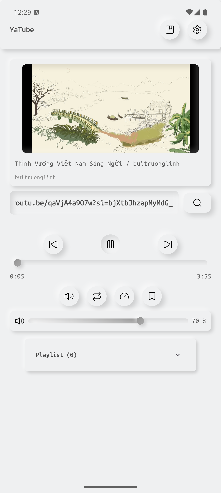
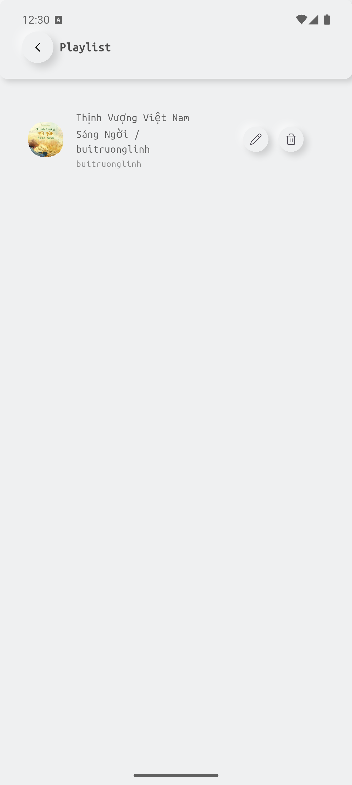
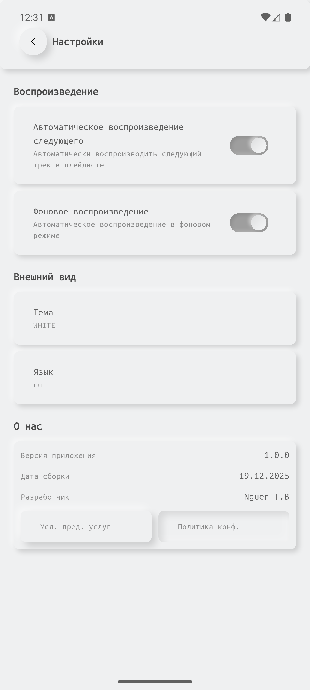

# YaTuber - Play YT background, no ads

Overview
--------
YaTube is a lightweight Flutter-based audio player built around YouTube content. The app extracts audio streams and provides playlist management, background playback, and a Neumorphic UI theme system.

Key Features
------------
- Play audio from YouTube videos (uses `youtube_explode_dart` for stream extraction).
- Background playback and foreground service support (Android).
- Playlist management (save / delete tracks in local storage).
- Theme system with multiple Neumorphic themes.
- Responsive UI with custom controls (play/pause, seek, volume, repeat, shuffle).

Screenshots
-----------
Place screenshots into `assets/screenshots/` (see the instructions below). Example screenshot references:

- Home / Player view:

	

- Playlist view:

	

- Settings / Theme:

	


Quick Start
-----------
Prerequisites

- Flutter SDK (stable) installed and configured: https://flutter.dev/docs/get-started/install
- Android SDK / Xcode (for iOS) as required
- A connected Android device or emulator for testing

Install dependencies

```bash
flutter pub get
```

Generate code (if you modified models / freezed files)

```bash
flutter pub run build_runner build --delete-conflicting-outputs
```

Run on a connected device (debug)

```bash
flutter run
```

Build release APK

```bash
flutter build apk --release
# Install on device (adjust path if needed)
adb install -r build/app/outputs/flutter-apk/app-release.apk
```

Important Android manifest & permissions
--------------------------------------
For background audio and network access make sure the following permissions and configuration are present in `android/app/src/main/AndroidManifest.xml`:

- `android.permission.INTERNET`
- `android.permission.FOREGROUND_SERVICE`
- `android.permission.WAKE_LOCK`
- `android.permission.POST_NOTIFICATIONS` (Android 13+ if you show notifications)

Also ensure `xmlns:tools` is declared in the root `<manifest>` tag if you use `tools:` attributes.

Troubleshooting
---------------
- 403 / ExoPlayer Source error: If playback fails with a 403 or invalid response code, YouTube may block direct streaming URLs. Use `youtube_explode_dart` to fetch audio-only streams and either play them directly with appropriate headers or download to a temporary file and play locally.
- Works in debug but not in release: check `minifyEnabled` / proguard settings in `android/app/build.gradle` (try disabling minify to diagnose). Also inspect the merged manifest and ensure `android:exported` and service configuration are correct for Android 12+.
- Check device logs with `adb logcat` to get precise runtime errors when an installed APK misbehaves on specific Android versions.

How to add screenshots
----------------------
1. Create the directory in your project root:

```bash
mkdir -p assets/screenshots
```

2. Put screenshot files (PNG preferred) into `assets/screenshots/`, for example:

```text
assets/screenshots/home_player.png
assets/screenshots/playlist.png
assets/screenshots/settings.png
```

3. Re-run `flutter pub get` (we added the `assets/screenshots/` entry to `pubspec.yaml` so Flutter will bundle them)

License & Attribution
---------------------
This project is provided as-is. Add your license here (MIT, Apache-2.0, etc.) or remove this section if proprietary.

Contributing
------------
- Fork the repo and open a pull request for bug fixes or features.
- Run tests and linters before PR.

Contact
-------
For questions, reach out to the maintainer: `Nguen T.B` (bak_nguen@vk.com).

---
